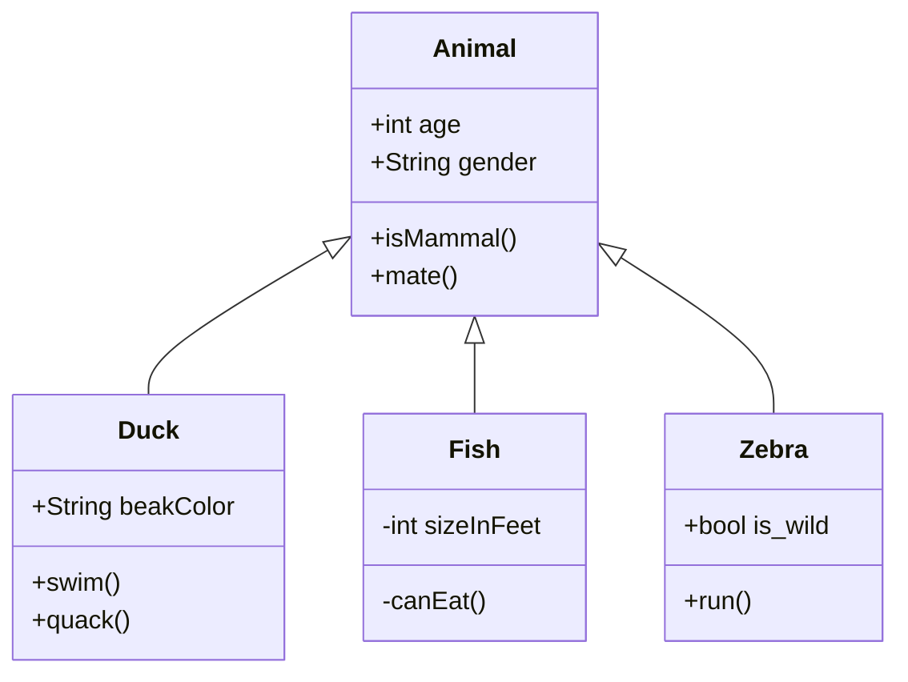
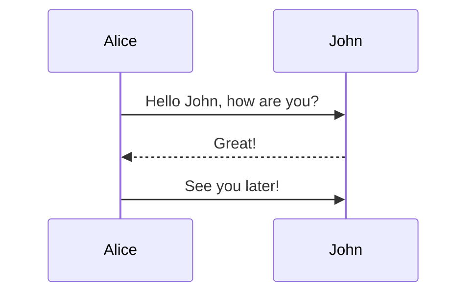

# Writing on GetHub Assignment

Software engineers need to be able to communicate technical information effectively to various stakeholders, including team members, clients, and management. Technical writing enables us to present complex information in a clear and concise manner, ensuring that everyone has a comprehensive understanding of the software being developed. This helps to avoid misunderstandings, delays, and other problems that can arise when technical information is not communicated effectively. 

This assignment is a simple introduction to writing on GitHub using **Markdown**. GitHub has its own flavor of Markdown[^1], so you must follow their syntax. Please see the [“Writing on GitHub”](https://docs.github.com/en/get-started/writing-on-github)documentation published by GitHub for more details on their Markdown syntax.

### Fenced Code Blocks

You can create fenced code blocks by placing triple backticks \`\`\` before and after the code block. Syntax highlighting in your fenced code block is enabled by adding an optional language identifier. For example, to syntax highlight Python code your fenced code block would begin with \`\`\`python.

```python
class Circle():
    def __init__(self, r):
        self.radius = r
        
    def area(self):
        return self.radius**2*3.14
        
    def perimeter(self):
        return 2*self.radius*3.14
```

### Mathematical Expressions

GitHub supports LaTeX formatted math within Markdown, it uses the cross-browser
JavaScript libary MathJax for rendering. Here is a mathematical expression for Binomial coefficients:

```math
\binom{n}{k} = \frac{n!}{k!(n-k)!}
```

[^1]: [GitHub Flavored Markdown Spec](https://github.github.com/gfm/)

### Diagrams

You can create diagrams in Markdown using four different syntaxes: mermaid, geoJSON and topoJSON, and ASCII STL. Similar to fenced code blocks, digrams are rendered by placing triple backticks \`\`\` before and after the diagram code block, but you must specify a syntax identifer (e.g., mermaid) after initial backticks.

Here is an example of a class diagram defined through the mermaid[^2] syntax.



And here is a sequence diagram:

[^2]: [Mermaid diagramming and charting tool](https://mermaid.js.org/)


